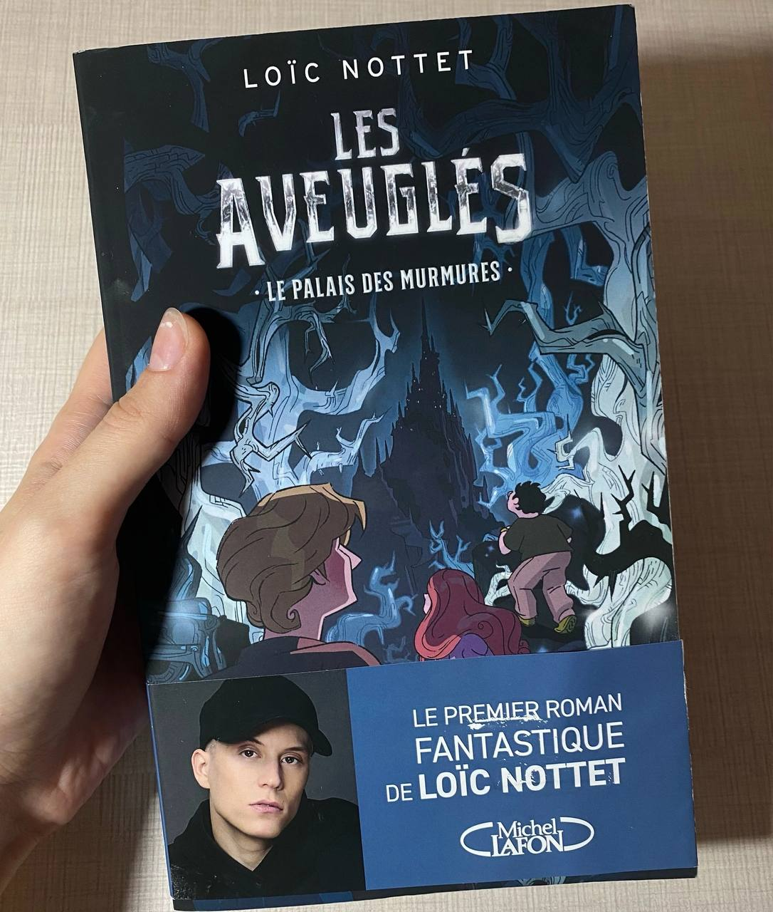

### __Hello everybody!__

Have you already felt all this autumn mood when you want to drink cocoa and watch different movies or read books? I love autumn for that. But since I am actively studying now, it is studying that takes most of the time. This week, for example, I did several laboratory works on Scientific Programming at once. I also watched several videos about neural networks ([here](https://youtube.com/playlist?list=PLZHQObOWTQDNU6R1_67000Dx_ZCJB-3pi&si=D_3Cw03OjZDtlBKc) and [here](https://youtube.com/playlist?list=PLQVvvaa0QuDcjD5BAw2DxE6OF2tius3V3&si=cLP2sUMQdJywcMUn)), because my future dissertation work assumes the use of a neural network to determine the optimal strategy for the redistribution of resources in a 5G network. 

But I have one piece of good news, because last weekend I finally picked up a book from the post office that my friend brought me straight from my beloved Paris. This is a mystical novel by a belgian singer - Loic Nottet, whom I have been listening to since his performance at Eurovision and I am very happy now that I have his book. 

By the way, if you don't know what to read these autumn evenings, then keep a selection of my favorite books: 
1. Victor Hugo [«Notre-Dame de Paris»](https://www.chitai-gorod.ru/product/sobor-parizhskoy-bogomateri-2513491?productShelf=&shelfIndex=0&productIndex=0) 
2. Erich Maria Remarque [«Arch of Triumph»](https://www.chitai-gorod.ru/product/triumfalnaya-arka-2602918?productShelf=&shelfIndex=0&productIndex=0) and [«Three Comrades»](https://www.chitai-gorod.ru/product/tri-tovarishcha-2666861?productShelf=&shelfIndex=0&productIndex=0) 
3. Ray Bradbury [«Fahrenheit 451»](https://www.chitai-gorod.ru/product/4510-po-farengeytu-2822350?productShelf=&shelfIndex=0&productIndex=0)
4. Veniamin Kaverin [«The Two Captains»](https://www.chitai-gorod.ru/product/dva-kapitana-2590405?productShelf=&shelfIndex=0&productIndex=0) 
5. Guillaume Musso [«An Apartment in Paris»](https://www.chitai-gorod.ru/product/kvartira-v-parizhe-2735645?productShelf=&shelfIndex=0&productIndex=1)

Have a nice week everyone, bye!

