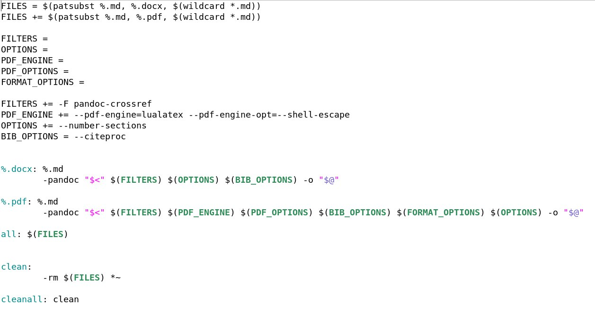

__Markdown__ is a lightweight markup language for creating formatted text using a plain-text editor. John Gruber created Markdown in 2004 as a markup language that is easy to read in its source code form. Markdown is widely used for blogging and instant messaging, and also used elsewhere in online forums, collaborative software, documentation pages, and readme files.

The initial description of Markdown contained ambiguities and raised unanswered questions, causing implementations to both intentionally and accidentally diverge from the original version. This was addressed in 2014 when long-standing Markdown contributors released CommonMark, an unambiguous specification and test suite for Markdown.

## Markdown syntax.

* To create a heading, add number signs (#) in front of a word or phrase. The number of number signs you use should correspond to the heading level. For example, to create a heading level three (\<h3>), use three number signs (e.g., \#\#\# My Header).

* To create paragraphs, use a blank line to separate one or more lines of text.

* To create a line break or new line (\ ), end a line with two or more spaces, and then type return.

* To bold text, add two asterisks or underscores before and after a word or phrase. To bold the middle of a word for emphasis, add two asterisks without spaces around the letters.

* To italicize text, add one asterisk or underscore before and after a word or phrase. To italicize the middle of a word for emphasis, add one asterisk without spaces around the letters.

* To emphasize text with bold and italics at the same time, add three asterisks or underscores before and after a word or phrase. To bold and italicize the middle of a word for emphasis, add three asterisks without spaces around the letters.

* To create a blockquote, add a > in front of a paragraph.

* To create an ordered list, add line items with numbers followed by periods. The numbers don’t have to be in numerical order, but the list should start with the number one.

* To create an unordered list, add dashes (-), asterisks (*), or plus signs (+) in front of line items. Indent one or more items to create a nested list.

* To add an image, add an exclamation mark (!), followed by alt text in brackets, and the path or URL to the image asset in parentheses. You can optionally add a title in quotation marks after the path or URL.

* In-text formulas are created similarly to LaTeX formulas.

* To convert a Markdown-file to pdf or docx, you can use the following Makefile and use the "make all" command on the command line.

You can read more about this [here](https://skillbox.ru/media/code/yazyk-razmetki-markdown-shpargalka-po-sintaksisu-s-primerami/) and [here](https://ru.wikibooks.org/wiki/%D0%9C%D0%B0%D1%82%D0%B5%D0%BC%D0%B0%D1%82%D0%B8%D1%87%D0%B5%D1%81%D0%BA%D0%B8%D0%B5_%D1%84%D0%BE%D1%80%D0%BC%D1%83%D0%BB%D1%8B_%D0%B2_LaTeX). 
