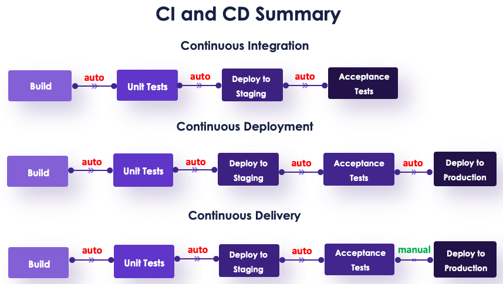

__Continuous Integration and Continuous Delivery (CI/CD)__ is a software development approach that aims to improve the speed, efficiency, and reliability of software delivery. This approach involves frequent code integration, automated testing, and continuous deployment of software changes to production. 
Before the adoption of CI/CD in the software development industry, the common approach was a traditional, waterfall model of software development. 
In this approach, developers worked in silos, with each stage of the software development life cycle completed in sequence. The process typically involved gathering requirements, designing the software, coding, testing, and deployment. 

*The disadvantages* of this traditional approach include: 
* Slow Release Cycles 
* High Failure Rates 
* Limited Collaboration 
* High Cost 
* Limited Agility 

CI/CD emerged as a solution to these disadvantages, by introducing a more agile and collaborative approach to software development. CI/CD enables teams to work together, integrating their code changes frequently, and automating the testing and deployment process. 

## Continuous Integration (CI) 
CI is the process of merging all the Developer code changes to a single shared main branch as often as possible, frequently. 
Developers merge their code changes, many times a day to the remote Git Repository's main branch. These code changes are then verified and validated by using automation to create builds and run tests on the created builds. 
So, the new code changes being pushed are built, integrated and tested in a few minutes, providing immediate feedback to the developer about the code status and any issues. 
Continuous Integration ensures that the application is not broken whenever new commits from all the developers are integrated into the Release branch of the Repository, as they are all tested well in advance.

## Continuous Delivery (CD) 
Continuous Delivery is the practice where the code changes are released frequently in shorter cycles to customers, quickly and reliably. 
In continuation with Automated Testing in CI, the application Release process is completely automated so that the code changes can be deployed incrementally at any point of time by just clicking a button (manual trigger). 
Generally, shorter release cycles are recommended. Depending on the size of the project, and business requirements, you can configure daily, weekly, fortnightly release schedules. 
The shorter the release cycle the easier it is to troubleshoot in case of any issue after deployment onto a Production environment. 

## Continuous Deployment (CD) 
Continuous Delivery without a manual trigger is Continuous Deployment. 
In Continuous Deployment, every code change is directly released to customers without any manual intervention if it successfully passes all the stages of your CI/CD pipeline. So, if there are no failures in any pipeline tests, every code change is available to the customers immediately.
This level of automation is made possible by a combination of several different tools and processes that work together to verify and push the code changes to production. 
Once the developer pushes the new code change, it is automatically built, integrated, tested, and directly deployed to the production environment. 

*The key benefits* of CI/CD include: 
* Faster Release Cycles 
* Improved Quality 
* Increased Collaboration 
* Reduced Risk 
* Cost-Effective 

In summary, CI/CD emerged as a solution to the limitations of the traditional, linear approach to software development. By introducing a more agile and collaborative approach to software development, CI/CD enables teams to work together, release software more frequently, and respond quickly to customer needs.

You can read more about this [here](https://vegastack.com/blog/continuous-integration-continuous-deployment-continuous-delivery/) and [here](https://www.freecodecamp.org/news/what-is-ci-cd/). 
